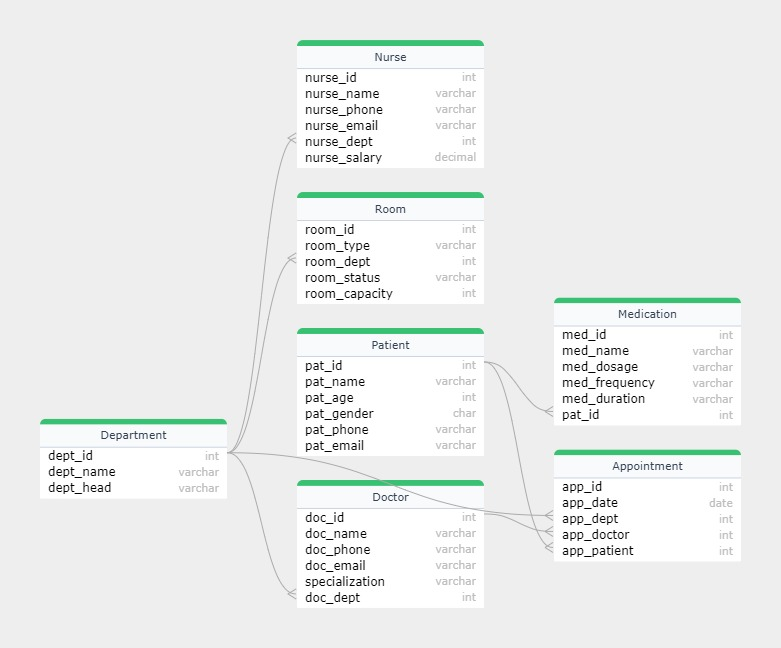

# Comprehensive Hospital Management System (CHMS)

A robust database design for efficiently managing hospital operations, including patient records, doctor schedules, medication tracking, and room assignments.

---

##  Features
- **Departments**: Manage departments with their heads.
- **Doctors**: Track doctor details, specializations, and associated departments.
- **Patients**: Maintain patient demographics, diagnoses, and contact details.
- **Rooms**: Assign rooms based on department and capacity.
- **Appointments**: Schedule and track appointments with doctors.
- **Medications**: Prescribe and manage medications for patients.

---

##  Database Structure
### Tables:
1. **Department**
   - `dept_id`, `dept_name`, `dept_head`
2. **Doctor**
   - `doc_id`, `doc_name`, `doc_phone`, `doc_email`, `specialization`, `doc_dept`
3. **Patient**
   - `pat_id`, `pat_name`, `pat_age`, `pat_gender`, `pat_phone`, `pat_email`, `pat_address`, `pat_diagnose`
4. **Room**
   - `room_id`, `room_type`, `room_dept`, `room_status`, `room_capacity`
5. **Medication**
   - `med_id`, `med_name`, `med_dosage`, `med_frequency`, `pat_id`
6. **Appointment**
   - `app_id`, `app_date`, `app_dept`, `app_doctor`, `app_patient`

---

##  ER Diagram

---

## 🔧 Prerequisites
- MySQL 8.0+ or equivalent.
- MySQL Workbench for executing SQL scripts.
